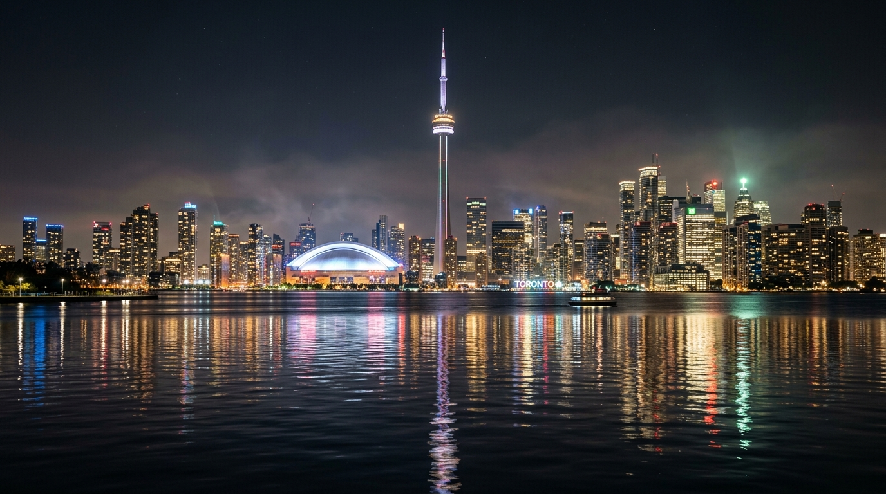

# Toronto Skyline 16:9 Window Matrix Audio Visualizer

An interactive 16:9 web audio visualizer where the Toronto night skyline (CN Tower, skyscrapers, Rogers Centre, Lake Ontario) drives a dynamic boxed equalizer in real-time.



## ✨ Features

- **16:9 Responsive Viewport**: Automatically scales across all screen sizes with fullscreen mode support (<kbd>F</kbd>).
- **Inverted Reflection Box Equalizer**: Slices the lake reflection into a clean grid of boxes that light up downwards from the middle shoreline to music frequencies.
- **Pure Original Image Colors**: No synthetic color tint overlays—reveals the crisp high-resolution original photograph slices.
- **Audio Inputs**:
  - **Bundled Synthwave Demo Track** (`assets/demo_track.wav`)
  - **Custom Audio Upload** (MP3, WAV, OGG, FLAC, M4A, AAC)
  - **Live Microphone Input**
- **Multiple Equalizer Modes**:
  - `Reflection EQ`: Vertical frequency columns lighting up reflection boxes downwards.
  - `Wave Cascade`: Cascading downward water ripples across the grid.
  - `Beat Matrix`: Rhythmic transient kick impacts illuminating the reflection.
  - `Radial Spire`: Downward shockwaves expanding from the CN Tower's reflection axis.
- **Customization Controls**:
  - Grid density (Columns & Rows / Box size)
  - Box border gap spacing
  - Audio sensitivity gain & decay smoothness
  - Shoreline horizon position adjustment
  - Glass box outline toggles

## 🚀 Quick Start

To run locally:

```bash
# Using Node.js serve
npx serve .

# Or using Python 3
python3 -m http.server 3000
```

Open `http://localhost:3000` in your browser.

## 🎵 Regenerating Demo Audio

To synthesize a new demo track:

```bash
node scripts/generate_audio.js
```

## ⌨️ Keyboard Shortcuts

- <kbd>Space</kbd>: Play / Pause
- <kbd>F</kbd>: Toggle 16:9 Fullscreen
- <kbd>M</kbd>: Mute / Unmute
- <kbd>←</kbd> / <kbd>→</kbd>: Skip -10s / +10s
- <kbd>Esc</kbd>: Close settings drawer
